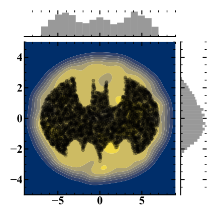

```@meta
Author = "Morgan Askins"
```
# Batman.jl
The __B__ayesian __A__nalysis __T__oolkit for __M__onitoring 
__A__nti-__N__eutrinos, is a package designed to perform statistical
analysis on small datasets in a generic way. The user may decide the
type of analysis to be performed including the posterior and prior
probability distributions, all while naturally including nuisance
parameters (such as systematic uncertainties).

## Package features

## Installation
Currently Batman.jl is not registered with METADATA.jl so a direct
link to the source is required by Pkg.jl.
```julia-repl
julia> using Pkg
julia> Pkg.add(PackageSpec(url="https://github.com/MorganAskins/Batman.jl"))
```
Or using the Pkg.jl REPL
```julia-repl
julia> ]
(v1.x) pkg> add https://github.com/MorganAskins/Batman.jl
```

## Batsignal
Logo for Batman.jl based on 
```julia
using PyPlot
σ(x) = @. √(1-x^2.0)
e(x) = @. 3σ(x/7.0)
s(x) = @. 4.2 - 0.5x - 2.8σ(0.5x-0.5)
b(x) = @. σ(abs(2-x)-1)-x.^2/11 + 0.5x - 3
c(x) = [1.7, 1.7, 2.6, 0.9]

p(x, f) = fill_between(x, f(abs.(x)), color="black" )

plt.axis("off")
p(3:0.01:7, e)
p(-7:0.01:-3, e)
p(4:0.01:7, t->-e(t))
p(-7:0.01:-4, t->-e(t))
p(1:0.01:3, s)
p(-3:0.01:-1, s)
p(-4:0.01:4, b)
p([0,0.5,0.8,1], c)
p(-[0,0.5,0.8,1], c)
```

